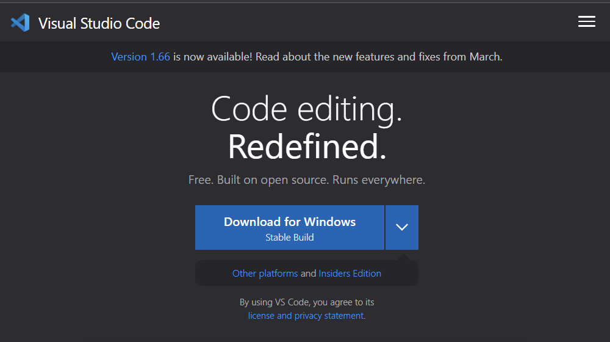

# Tutorial for Incoming 15L Students regarding Lab 1

## **Installing VScode** 
* First you would go to the Visual Studio Code website by following this link https://code.visualstudio.com/ and then download based upon which platform you are using.
* After you downloaded you can open VS Code and then following the prompts that come up once you open it and then you should be able to open a window in Visual studio Code.

## **Remotely Connecting** 
* You first want to install [OpenSSH](https://docs.microsoft.com/en-us/windows-server/administration/openssh/openssh_install_firstuse) and then you can find your account on this [Website](https://docs.microsoft.com/en-us/windows-server/administration/openssh/openssh_install_firstuse)
* You then open up a new terminal in Visual Studio Code and type in $ ssh cs15lsp22zz@ieng6.ucsd.edu and replace zz with your specific letters in the account
* Once you do then you will get some prompts and you would anwer yes to continue and the enter your password, you are now logged in.
