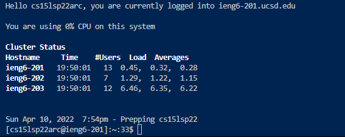
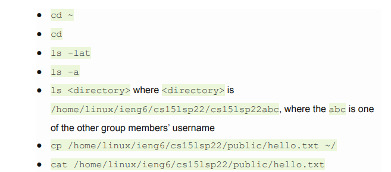
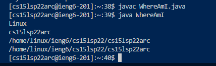
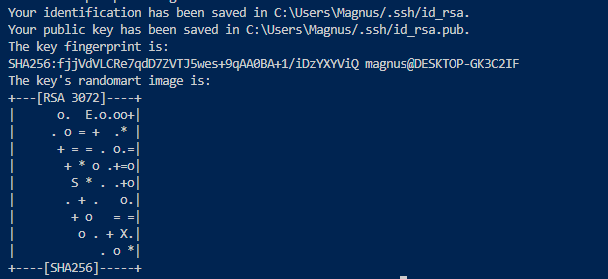
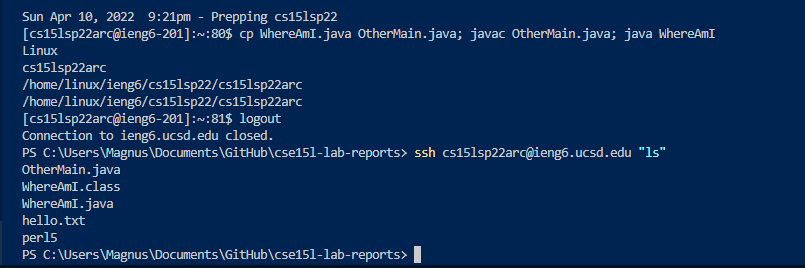

# Tutorial for Incoming 15L Students regarding Lab 1

## **Installing VScode** 
* First you would go to the Visual Studio Code website by following this link https://code.visualstudio.com/ and then download based upon which platform you are using.
* After you downloaded you can open VS Code and then following the prompts that come up once you open it and then you should be able to open a window in Visual studio Code.

## **Remotely Connecting** 
* You first want to install [OpenSSH](https://docs.microsoft.com/en-us/windows-server/administration/openssh/openssh_install_firstuse) and then you can find your account on this [Website](https://docs.microsoft.com/en-us/windows-server/administration/openssh/openssh_install_firstuse)
* You then open up a new terminal in Visual Studio Code and type in $ ssh cs15lsp22zz@ieng6.ucsd.edu and replace zz with your specific letters in the account
* Once you do then you will get some prompts and you would anwer yes to continue and the enter your password, you are now logged in.

## **Trying Some Commands**
* We have many commands at our disposal such as cd, ls, pwd, cp and many more. For this step we just want you to run each commands and see what it produces in order to get some familiarity 
* Try to produce an error with the commands as well as find the files of your other group members

## **Moving Files with scp**
* We are going to use the command called scp which is always ran from your computer
* We create a file called WhereAmI.java which contains:
> class WhereAmI {
public static void main(String[] args) {
System.out.println(System.getProperty("os.name"));
System.out.println(System.getProperty("user.name"));
System.out.println(System.getProperty("user.home"));
System.out.println(System.getProperty("user.dir"));
}
}
* We then run the command -> scp WhereAmI.java cs15lsp22zz@ieng6.ucsd.edu:~/ and we should be good,you can use ls to view location of file and you can now run javac and java on the ieng6 computers.

## **Setting an SSH Key**
* First in order to set up the SSH key we need to make sure that we are working in the client and then run these commands:
* (Make sure to follow the prompts and for passphrase just enter/no paraphrase)
> ssh-keygen

> ssh cs15lsp22zz@ieng6.ucsd.edu

>  mkdir .ssh

> logout
* Go back to client then run:
>  scp /Users/<user-name>/.ssh/id_rsa.pubcs15lsp22zz@ieng6.ucsd.edu:~/.ssh/authorized_keys
* (user-name is based upon output from above command)
* Should now not need to input password

## **Optimizing Remote Running**
* There are ways in which we can make the running of remote commands much more efficient and less time consuming
* This includes putting a command in quotation marks right after you run an ssh command which will run it directly rather than having to ssh then run the command
* We can also seperate commands by semicolons which will help to run multiple commands 

