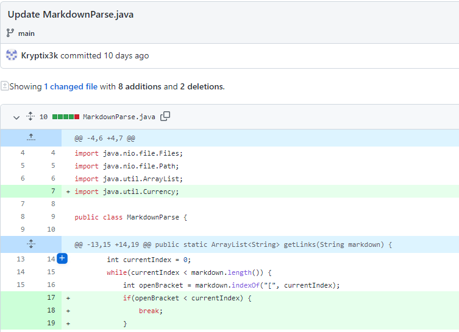

# Lab-Report-2 Week 4 

## **First Code change:**

## Code change

## Test file: [1stTestFile](https://github.com/Kryptix3k/markdown-parser/blob/main/test-file.md)

## First error:
[image](FirstError.PNG) 

### The input that caused the error at the command input would be the test-file.md which contained an extra line below the links which contained nothing. This made it so the program would never exit out and produce an infinite while loop and attributed to the  OutOfMemoryError, which in this case would be our symptom.