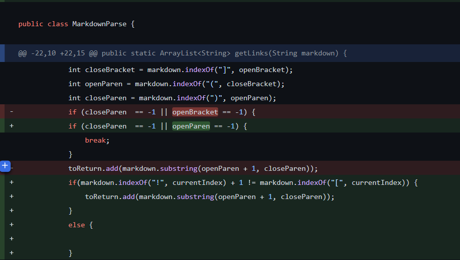
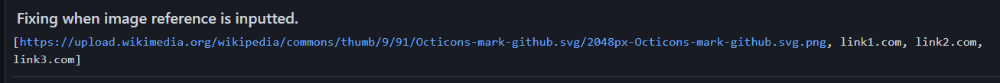

# Lab-Report-2 Week 4 

## **First Code change:**

## Code change

## Test file: [1stTestFile](https://github.com/Kryptix3k/markdown-parser/blob/main/test-file.md)

## First error:
 

### The input that caused the error at the command line would be the test-file.md which contained an extra line below the links which contained nothing. This made it so the program would never exit out and produce an infinite while loop bug and attributed to the  OutOfMemoryError, which in this case would be our symptom.

## **Second Code Change:** 

## Code Change

## Second Test File: [2ndTestFile](https://github.com/Kryptix3k/markdown-parser/blob/main/myTestFile.md)

## Second error:

### The input that caused the error at the command line would be the myTestFile.md which didnt contain parenthesis for a link. Our bug in this case was that our program was running even though neither open or closed parenthesis existed leading to an index of -1.This made it so the program would encounter an IndexOutOfBoundsException symptom because it would make the index to -1 which is not valid since parenthesis didn't exist.

## **Third Code Change:**

## Code Change 

## Third Test File: [3rdTestFile](https://github.com/Kryptix3k/markdown-parser/blob/main/myTestfileTwo.md)

## Third error:

### The input that caused the error at the command line would be the myTestfileTwo.md which contained a reference to an image. The symptom of this error would be that references to images addresses were also being printed, however only website links were supposed to be printed only. The bug in this program is that the code could not recognize the difference between an image and a link as it just got whatever was inside the parenthesis rather than first determining if it was an image or a link.