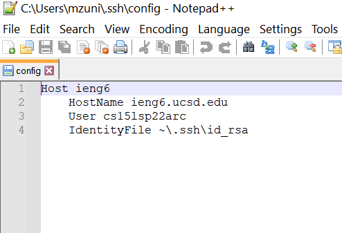
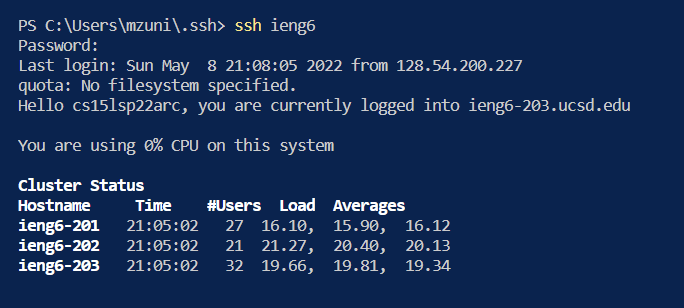
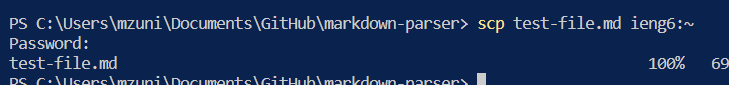
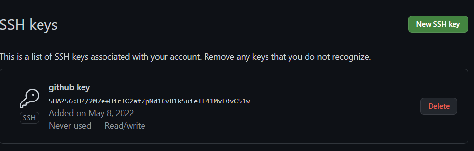
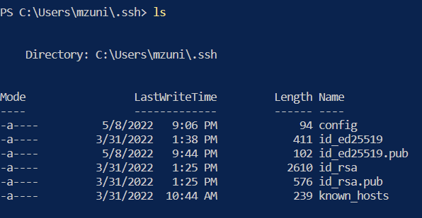
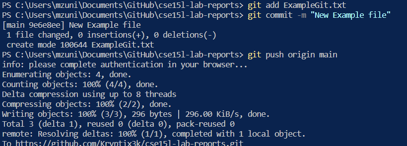

# Streamlining ssh Configuration
## In this Group Choice, we created a config fle which allowed us to easier log into our ieng6 account without having to enter the long username everytime we run ssh. This allows us to log into our remote account much more efficiently and we did this through editing the config file in the ssh directory.

# Set up Github Access from ieng6
## Public key stored on Github:

## Public and Private key stored on User Account:

## Using git commands to push new files to main repo:

## [Link](https://github.com/Kryptix3k/cse15l-lab-reports/commit/9e6e8ee1f3c927bbf4d53245492ac4711e547531) to commit

# Copy Whole Directories with `scp -r`
## Copied markdown-parse directory to server:
