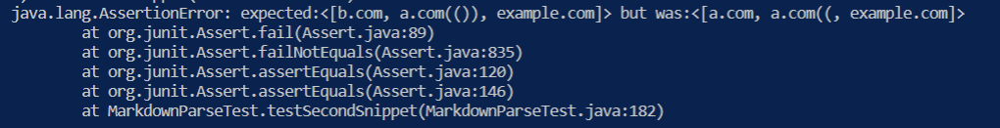

[Reviewed Repo](https://github.com/AllKeng/markdown-parser)

[My Repo](https://github.com/Kryptix3k/markdown-parser)

## **First Snippet**

### Expected Out for test1: `[google.com]`

### My Test failure 1:

### Reviewed Test failure 1:

## **Second Snippet**

### Expected output for test2: `[b.com, a.com(()), example.com]`

### My Test Failure 2:

### Reviewed Test Failure 2: 

## **Third Snippet**

### Expected output for test 3: `[https://sites.google.com/eng.ucsd.edu/cse-15l-spring-2022/schedule]`

### My Test failure 3:
 

### Reviewed Test Failure 3:

## **Implementation Questions**

- A code change that we could implement could be to add a conditional, checking for the existance of a back tick and ignoring whatever is between them, however this might not be only a small code change due to conflicts in text formatting.
- For this change I believe there is no simple way to change the code in order to correct it, because we would have to create a different function for open parenthesis or brackets that are not accounted for as it wasn't designed with the thought of nested behavior.
- For this code change we can as we would just use a conditional checking for newlines between parenthesis and brackets and if it does, ignore it, as it is not a link.
