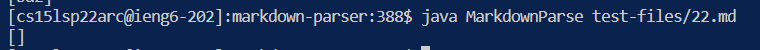
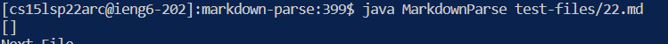

# **Test Files that I chose**
[Test file for 22nd Test](https://github.com/nidhidhamnani/markdown-parser/blob/main/test-files/22.md)

[Test file for 577nd Test](https://github.com/nidhidhamnani/markdown-parser/blob/main/test-files/577.md)
## In order to compare these two files I used the bash script to run all the files and the command called vimdiff.


# **Comparing test files output based upon implementation**

# Test File 22.Md
## My Output:


## Given Output:


## Correct Output: ```[/bar*]```

## Bug/fix
[image3]() 