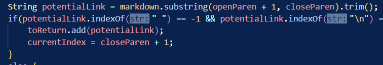
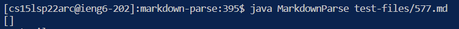
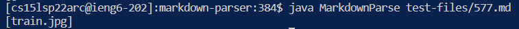
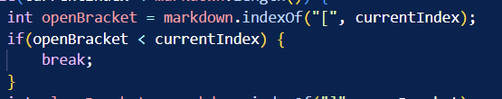

# **Test Files that I chose**
[Test file for 22nd Test](https://github.com/nidhidhamnani/markdown-parser/blob/main/test-files/22.md)

[Test file for 577nd Test](https://github.com/nidhidhamnani/markdown-parser/blob/main/test-files/577.md)
## In order to compare these two files I used the bash script to run all the files and the command called vimdiff.


# **Comparing test files output based upon implementation**

# Test File 22.Md
## My Output:


## Given Output:


## Correct Output: ```[/bar*]```

## Bug/fix

## Both of these implementations of MarkDownParse fail for this test file.The bug in this case is that the backslashes are being treated as a way to exit the code and thus the given code is not outputting. To fix this we would have jave to consider the text inside the parenthesis and get rid of slashes, quotes and whitespaces.

# Test File 577.Md 
## My Output:


## Given Output:


## Correct Output: ```[]```

## Bug/Fix 

## The implementation that fails is the given implementation as it produces the incorrect output. The bug is that the given implementation does not account if a link could be an image by if the ```!``` comes before the ```[]```. So in order to fix this we should add a condition that checks for it before the openBracket variable is established.